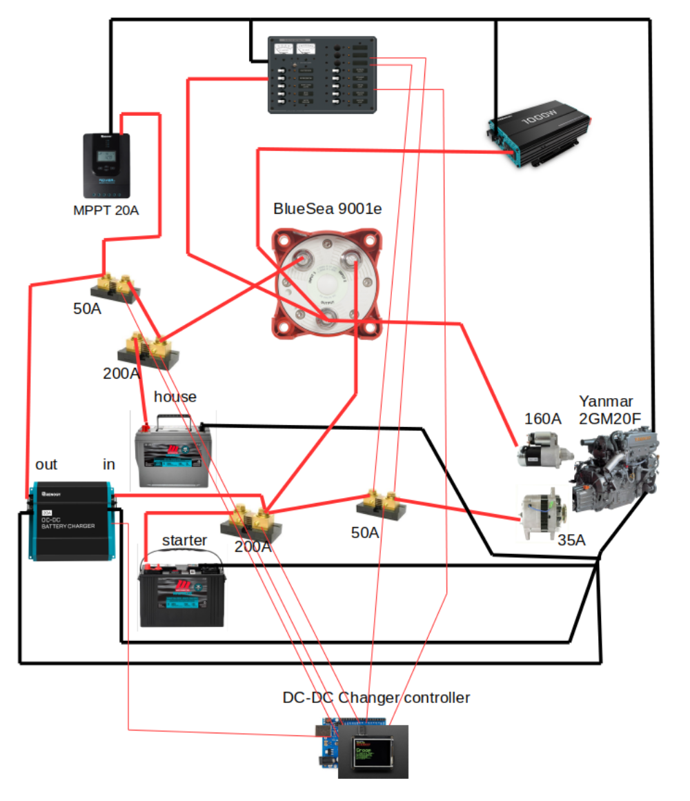

# Sailboat Batterie Monitor System
Here's a batterie monitor system I built for my sailboat.
Why not buy a product off the shelf? Good question. I guess the main reason is that I can get exactly the feature I needed.
And my system is mostlikely cheaper as well.
But at the end I think the main reason is that was fun to build.

##The requirement I had:
* Monitor 2 batterie bank: voltage, current, energy (amp.hour).
* Monitor the solar charger (current).
* Monitor the alternator (current).
* Control a DC-DC charger: charge the house batterie from the starter batterie when the alternator is pushing current
* Hability to set the DC-DC charger to fast charge (20A) or slow charge (10A).
* Add engine timer.

I use a [DC-DC charger from Renogy](https://ca.renogy.com/20a-12v-dc-to-dc-on-board-battery-charger/) for two reasons: I wanted the starter battery to always be connected to the alternator. And I wanted a "smart" charger for the AGM house battery. The starter battery is a cheap starter marine one.

##Hardware
* A main processor is an Arduino Mega. I started with an Ardunio Uno but I ran out of io ports.
* A [arduino protoboard] (https://www.adafruit.com/product/2077) to help with the connection
* A TFT resistive touch screen.
* Amp meter [INA219 from Adafruit](https://www.adafruit.com/product/904). to which I added a parallel shunt resitor.
* 200A, 75 ma,  shunt resistor on both batteries
* 50A, 75 ma,  on solar charger and alternator.
* Two relays to control the DC-DC charger.

##Custom board
To help with connecting everything together I built few boards.
* A board with two INA219 for the main batterie

* Two board with one INA219 for the solar charger and alternator

* A board for the relay to control the DC-DC charger.

* An arduino prototype board.

* I built custom boxes for all these boards using a 3D printer.

##Schematic diagram

##Some pictures of the installation

##Controler display

